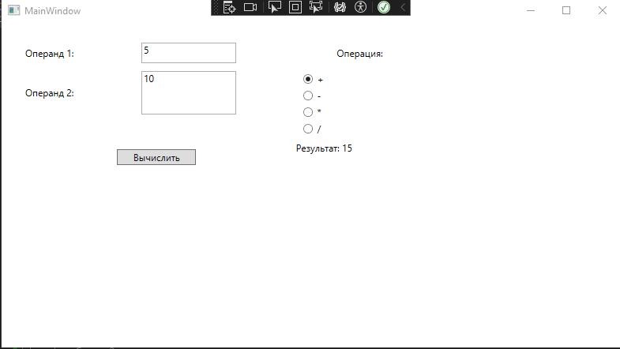

## Способы отладки

В этом проекте были использованы следующие способы отладки в Microsoft Visual Studio:

- **Точки останова**: Использовались для остановки выполнения кода в определенных местах, что позволяло проверять значения переменных и состояние программы.
- **Стек вызовов**: Использовался для анализа последовательности вызовов функций и методов, что помогло выявить ошибки в логике.

## Скриншот работы приложения

